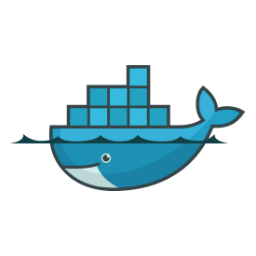
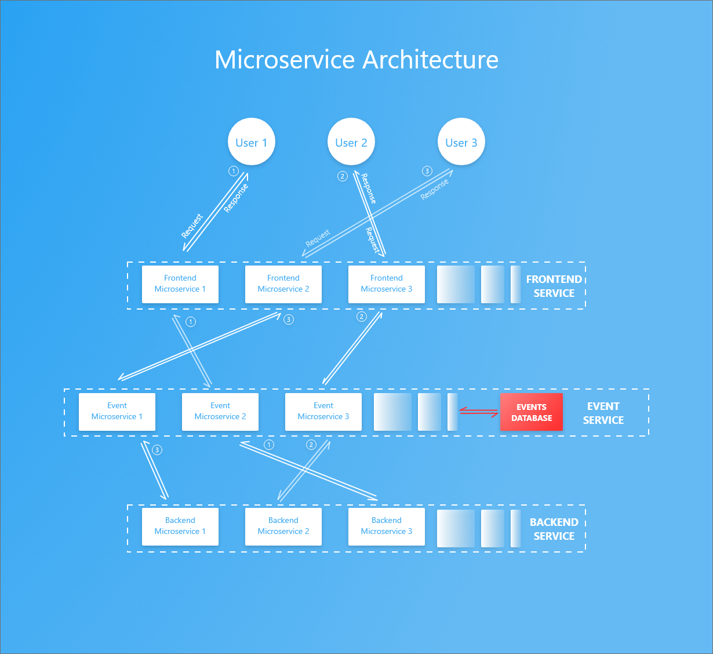
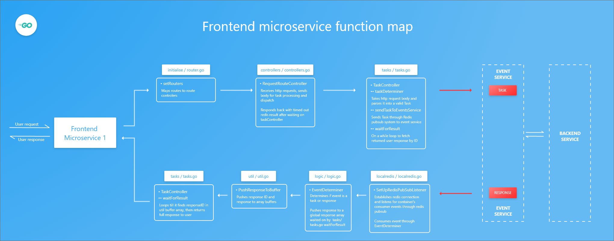
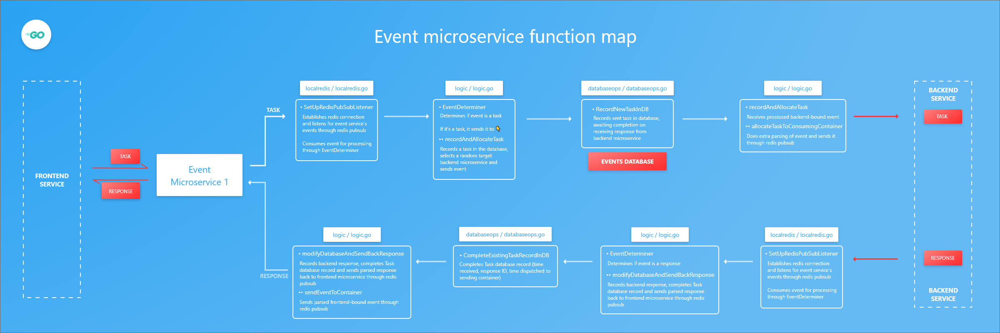
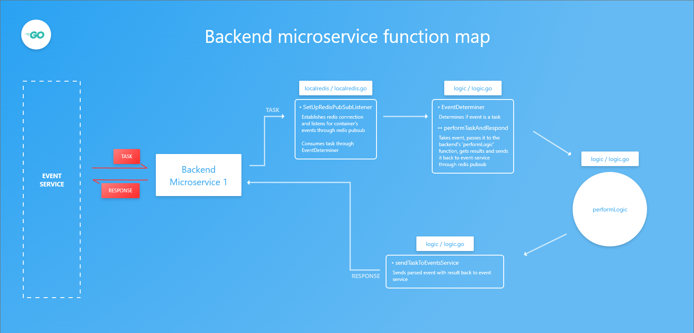

## An Event Based Microservice Architecture

<div style="height:80px; width: 120px; display: inline-flex; flex-direction: row; justify-content: center; align-items: center;">



</div> 


### Table of Contents
* [Project Overview](#project-overview)
* [Internals](#internals)
* [Tests](#tests)
* [Deployment](#deployment)
* [Possibilities](#possibilities)
* [Upcoming Updates](#upcoming-updates)


### Project Overview
---
_**Intro**_

This project aims to open source development of Docker image templates for an event-based microservice architecture in Go. The term 'event-based microservice' is used to mean a cluster of services communicating primarily through events

It currently assumes 3 main services namely: 
 - frontend
 - events
 - backend

which use Redis pubsub service to pass events and MongoDB to store logs of request events.

Requests are received by the frontend service which sends it to the event service. It's then added to the database and passed on to the target backend service which performs the logic and returns a response. The event service then completes the task record and returns it to the requesting frontend service.

_**Inspiration**_

The inspiration for this project came from desiring a better micoservice architecture due to complications faced in [Complex Voting App](https://github.com/EliudArudo/Dockersed-Complex-Voting-App) project. Its microservices communicate primarily through **http**. Among its services is a manager service which sends tasks to the worker service through Redis pubsub meaning that any http request sent to it cannot return a valid response. Each response has to be waited on through the Redis subscription.

Another issue is the fact that all worker microservices consume the task sent by the manager. The workaround to prevent this involves restricting the task to the first worker microservice receiving it using a thin time margin. This has a **70% success rate** with an astounding remainder left for error.

It also became important to record all requests in a database to easily identify the root cause of system failure. This stores historical snapshots of our system states which can then be used to test its integrity using any point in time as reference.

_**Languages**_

Service image templates in this repo are written in **Go**. Other languages include:
- [NodeJS](https://github.com/EliudArudo/Container-Events-Communication-Test-NodeJS)

You're more than welcome to check out its internals and rewrite it in your desired language.


### Internals
---
_**Architectural Overview**_



The architecture consists of 3 main services namely **frontend, event** and **backend**. Every request and its subsequent response is handled by the same microservice in each service.

The event service is attached to a database to log all requests and responses.

1. Request sent is converted to a task by frontend service which:
   - Publishes it to event service.
2. Event service receives task through Redis subscription and records the it in its database then:
   - Publishes the processed task to backend service. 
3. Backend service receives it through subscription then:
   - Performs logic and publishes back results.
4. Event service receives it through subscription and:
   - Stores the response, finishes the task record in database and
   - Publishes it back to the frontend service
5. Frontend service receives it and:
   - Returns the result in a http response
 
Redis is used here as the publishing and subscription handler because it's great for quick prototyping in a Docker swarm service.


_**Frontend Service**_



- Uses Go's Gorilla/Mux package for routing and Redis for publishing and subscription. 
- Listens for requests on the '/' and '/task' routes (You can add more routes to suit your needs).

All files referred to in this frontend service section can be found in the directory ***'src\github.com\eliudarudo\consuming-frontend\\'***

##### On sending a http request
Routes are mapped to their respective controllers through `func setRouters()` **(initialise/routers.go)**

1. The `func RequestRouteController()` **(controllers/controllers.go)** function
   - Receives http requests, sends body for task processing and dispatch
   - Responds back with timed out if redis does not return response
2. Processes task using `func TaskController()` **(tasks/tasks.go)**  
   - Determines Task type on `func taskDeterminer()` **(tasks/tasks.go)** which takes http request body and parses it into a valid Task
   - Publishes task to event service on `func sendTaskToEventsService()` **(tasks/tasks.go)**
   - Waits for response on `func waitForResult()` **(tasks/tasks.go)** which loops on a timeout searching for pushed response identified by ID

##### On getting back a response from the event service
1. It's received through `func SetUpRedisPubSubListener()` **(localredis/localredis.go)** which establishes redis connection and listens for container's consumer events through redis pubsub
2. Events are sent to the `func EventDeterminer()` **(logic/logic.go)** which determines if event is a response.
3. The response is then pushed to the container's response buffers through `func PushResponseToBuffers()` **(util/util.go)** which will be picked up by the `func waitForResult()` function in **(tasks/tasks.go)**.
4. Found response is returned as http response


_**Events service**_



- Uses Redis for publishing and subscription. 
- Connected to it's own instance of MongoDB database.

All files referred to in this event service section can be found in the directory ***'src\github.com\eliudarudo\events-service\'***.

##### On receiving an event (From frontend or backend services)
1. It's received on `func SetUpRedisPubSubListener()` **(localredis/localredis.go)** which establishes redis connection and listens for events.
2. The event is sent to the `func EventDeterminer()` **(logic/logic.go)** which categorizes it to a task/response.
    - If task:
      - Sends it to `func recordAndAllocateTask()` **(logic/logic.go)** function which: 
        - Passes it on to `func RecordNewTaskInDB()` **(databaseops/databaseops.go)** function which records it in the database. The record will be completed on receiving response from backend service. It returns a processed backend service bound event which:
      - Is received from `func recordNewTaskInDB()` **(databaseops/databaseops.go)** function and finally: 
      - Extra parsing of event is done which is then published to backend service through the `func allocateTaskToConsumingContainer()` **(logic/logic.go)** function.
        > `func allocateTaskToConsumingContainer()` uses a **dockerAPI** local package to fetch the target service container using a `task-map.json` file. 
        ###### task-maps.json file
        ``` 
          { // TASK :  TARGET-SERVICE
            "NUMBER": "backend", 
            "STRING": "backend"
          }
        ```
        > It's **IMPORTANT** to name your target service to include its corresponding mapped keyword, e.g the Task 'NUMBER' can only be consumed by a service with the *'backend'* keyword in its name.

    - If event received is a response:
      - It's sent to `func modifyDatabaseAndSendBackResponse()` **(logic/logic.go)** function which:
        - Passes it on to `func CompleteExistingTaskRecordInDB` **(databaseops/databaseops.go)** function to complete the corresponding Task database record (time received, response ID, time dispatched to sending container) then:
        - Does extra parsing of event and publishes it to frontend service through `func sendEventToContainer()` **(logic/logic.go)** function.  


##### Database operations


The image above illusrates how a task or response received by an event microservice through `func recordAndAllocateTask()` **(logic/logic.go)** is recorded in the database through `func modifyDatabaseAndSendBackResponse()` function in the **(logic/logic.go)** file.

All functions referred to here can be found in the **(src/github.com/eliudarudo/databaseops/databaseops.go)** file.

*If TASK is received:*
1. It's processed by `func RecordNewTaskInDB()` function which:
2. Fetches a similar existing task using its request body through `func getExistingTask()` then:
    - Uses the request body to fetch a previously stored request document ID through `func getExistingRequestDocumentID()` and
      - If it **exists**: it parses database document to standard event object with response field having actual response then returns it.
      - If it **does not exist**: it adds a new request record  using `func recordNewTaskAndRequest()` and: 
        - Adds a request record returning the ID using `func saveNewRequestAndGetID()` then:
        -  Inserts task into database using `func recordNewInitialisedTaskWithRequestID()` and returns a backend service consumable parsed task from `func getNewParsedTask()`.

*__If RESPONSE is received:__*
1. It's processed by `func CompleteExistingTaskRecordInDB()` function which checks if task with the response already exists and
   - If it **does not exist**: 
	   - Saves response in database and get's newly stored document using `func saveNewResponseAndGetID()` then:
	   - Fetches existing task record and adds time recevied, response ID and time sent fields using `func completeRecordInDB()` and:
	     - Returns a processed task into frontend consumable event with response field containing actual response from `func getParsedResponse()`.
   - If it **exists**:
      - Returns a frontend bound processed task which has a response field containing actual response from `func getParsedResponse()`.

_**Backend service**_



- Uses Redis pubsub.

All files referred to here are to be found in the directory ***'src\github.com\eliudarudo\consuming-backend\\'***

##### On receiving a task from the event service
1. It's received by `func SetUpRedisPubSubListener()` **(localredis/localredis.go)** function which establishes redis connection and listens for container's consumer events through redis pubsub then:
2. Sent to the `func EventDeterminer()` **(logic/logic.go)** which determines if the event is the container's assigned task:
   - Task logic is performed in `func performTaskAndRespond()` **(logic/logic.go)** which takes event, passes it to the `func performLogic()` **(logic/logic.go)** function and gets results
   - Results sent published to event-service through `func sendTaskToEventsService()` **(logic/logic.go)**

##### On receiving a response from any service
No action set up since it's not configured to receive responses.


### Tests
---
Ensure that you have Docker installed to follow through this section.

##### Model request

Tests simple *addition*, *subtraction*, *multiplication*, *division*  of 2 numbers and *string concartanation*.

POST requests sent to *http://localhost:4000/task* should have JSON data in the following format:

> Compare the Tasks with **src/github.com/eliudarudo/events-service/tasks/task-maps.json** file
 - `For addition:`  
 ```
  {
    "a1": 5,
    "a2": 10
  }
```
> Task - NUMBER - determined using type of property values.

> Subtask - Addition - determined using field keyword 'a'.

The curl request:
```
> curl -i --data '{"a1": 5, "a2": 10 }' http://localhost:4000/task --header 'Content-Type: application/json' --header 'Accept: application/json'
```
yields:
```
{
  "message": "OK",
  "result": "15"
}
```
> Result is addition of 5 + 10.

  - `For subtraction:`  
 ```
  {
    "s1": 4,
    "s2": 7
  }
```
> Task - NUMBER - determined using type of property values.

> Subtask - Subtraction - determined using field keyword 's'.

The curl request:
```
> curl -i --data '{"s1": 4, "s2": 7 }' http://localhost:4000/task --header 'Content-Type: application/json' --header 'Accept: application/json'
```
yields: 
```
  {
    "message": "OK",
    "result": "-3"
  }
```
> Result is addition of 4 - 7.

  - `For multiplication:`  
 ```
  {
    "m1": 4,
    "m2": 7
  }
```
> Task - NUMBER - determined using type of property values.

> Subtask - Multiplication - determined using field keyword 'm'.

The curl request:
```
> curl -i --data '{"m1": 4, "m2": 7 }' http://localhost:4000/task --header 'Content-Type: application/json' --header 'Accept: application/json'
```
yields:
```
  {
    "message": "OK",
    "result": "28"
  }
 ```
> Result is addition of 4 * 7.

  - `For division:`  
 ```
  {
    "d1": 4,
    "d2": 7
  }
```
> Task - NUMBER - determined using type of property values.

> Subtask - Division - determined using field keyword 'd'.

The curl request:
```
> curl -i --data '{"d1": 4, "d2": 7 }' http://localhost:4000/task --header 'Content-Type: application/json' --header 'Accept: application/json'
```
yields:
```
  {
    "message": "OK",
    "result": "0.5714285714285714"
  }
 ```
 > Result is addition of 4 / 7.

  - `For string concartenation:`  
 ```
  {
    "a1": "a",
    "a2": "b"
  }
```
> Task - STRING - determined using type of property values

> Subtask - Addition - determined using field keyword 'a'

The curl request:
```
> curl -i --data '{"a1": "a", "a2": "b" }' http://localhost:4000/task --header 'Content-Type: application/json' --header 'Accept: application/json'
```
yields:
```
RESPONSE BODY:
  {
    "message": "OK",
    "result": "ab"
  }
 ```
> Result is simple string concartenation of "a" and "b"

> NOTE: Request body can only take two properties

##### Customisation
You can customise tasks and subtasks by doing the following:

*Frontend microservice*

Modifying Tasks and Subtasks classification in `func DetermineTask()` and `func DetermineSubTask()` **(/src/github.com/eliudarudo/consuming-frontend/tasks/tasks.go)** functions respectively.

*Events microservice*
Mapping tasks to keywords contained in your target service as mentioned [here](#task-maps.json-file) (file found in **(src/github.com/eliudarudo/events-service/tasks/)** directory).

> NOTE: Ensure tasks and subtasks are consistent across frontend, events and backend services. You also need to adjust/add environment variables and connect them to the different redis subscription channels.


##### Multiple request with concurrency tests
Apache Bench was used for this through [XAMPP]() control panel.

The machine used for testing had the following specs:
```
Processor: Intel DuoCore i5-3339Y CPU @1.50GHz (Max 1.9GHz)
RAM: 8.00GB
OS: Windows 10 Pro
Version: 1803
```

`Docker commands`

Open your terminal and change directory to root directory where `docker-stack.yaml` file exists then run the following commands to:

Set up the stack:
```
> docker stack deploy -c docker-stack.yaml <YOUR-STACK-NAME>
```
Check if all services are up:
```
> docker service ls
```
The 3 services specified in the **docker-stack.yaml** by default are:
- consuming-frontend
- event-service
- consuming-backend

Query service status once your stack is set up:
```
# This command shows logs in real time. In case you want a simple list,
# omit '--follow'
> docker service logs --follow <YOUR-STACK-NAME>_consuming-frontend
```

*Update a service image* e.g to update consuming-frontend service:
```
> docker service update --force --image eliudarudo/events-communication-consuming-frontend:latest   <YOUR-STACK-NAME>_consuming-frontend

# Updating service image using your build docker image
> docker service update --force --image <YOUR-DOCKER-NAME>/events-communication-consuming-frontend:latest   <YOUR-STACK-NAME>_consuming-frontend
```

*Scale a service*:
```
> docker service scale <YOUR-STACK-NAME>_consuming-frontend=10
```

*Restart a service* in case it's acting up:
```
> docker service scale <YOUR-STACK-NAME>_consuming-frontend=0 && docker service scale <YOUR-STACK-NAME>_consuming-frontend=10
```

*Remove the stack*:
```
> docker stack rm <YOUR-STACK-NAME>
```

***Types of tests***
1. `Frontend tests` 
> Involve requests to base route `'/'`. Can be used for docker's HEALTHCHECK feature which prompts a container to check it's up status.
2. `Full tests` 
> Involves requests made to `'/task'` route to test all round functioning of the system.
3. `Integration tests` 
> Involves swapping our service images with NodeJS equivalent images.

You need a [terminal](#multiple-request-with-concurrency-tests) with Apache Bench testing set up to run:
```
> ab <APACHE-BENCH-COMMAND>
```

***Results***

`Frontend tests`

A/B command used is:
```
# Testing 100 requests, 10 requests per second
> ab -n 100 -c 10 http://localhost:4000/
```

*Tabulated results*

| reqs | req/s  | res time(avg) |
|:-----|:-----: | :------------:|
| 100  |   1    |      5ms      | 
| 1000 |  10    |      26ms     |
| 5000 |  500   |      1.1s     |


`Full Tests`

You need a text file for these tests holding JSON data needed in the POST request body. The file holds the following content:
```
{"a1": 5, "a2": 10}
```
Refer to [this](#model-request) section to see which JSON data you can attach here.

Please note the text file's path. `test.txt` is used below as an example.
```
# Testing 100 requests, 10 requests per second
> ab -n 100 -c 10 -p "<PATH-TO-YOUR-FILE>\test.txt" -T "application/json" http://localhost:4000/task
```

*Tabulated results*

|    req       |  req/s |  response time (avg) |
|:-------------|:------:|:--------------------:|
|   100        |   1    |        81ms          | 
|   1000(max)  |  10    |        2.2s          | 


`Integration tests`

*Tabulated results*

|Frontend/Events/Backend|     response time (avg)       |
|-----------------------|:-----------------------------:|
| Go/Go/Go              |  1.1s (500 reqs, 5 reqs/s)    |
| Go/Go/*NodeJS*        |  2.5s (500 reqs, 10 reqs/s)   |
| Go/*NodeJS*/Go        |  2s (500r reqs 10 reqs/s)     |
| *NodeJS*/Go/Go        |  122ms (1000 reqs, 1 reqs/s)  |
| Go/*NodeJS*/*NodeJS*  |  2s (500 reqs, 10 reqs/s)     |
| *NodeJS*/Go/*NodeJS*  |  2.4s (500 reqs, 10 reqs/s)   |
| *NodeJS*/*NodeJS*/Go  |  3.2s (2500 reqs, 100 reqs/s) |


### Deployment
---
_**Build your own docker images**_
The first step is to clone this repo into your local directory. Please make sure you have Go SDK tools installed in your system. We'll need to generate two files for each or our services namely: `go.mod` and `go.sum`. These are crucial in building our Docker images. Change directory into each of the service directories, e.g `src/github.com/eliudarudo/consuming-frontend` and run:
```
go mod init github.com/eliudarudo/consuming-frontend && go build

```
You will get some errors about some implementations missing for the  Docker package. We solve that by getting a previous version of it by running:
```
go get github.com/docker/docker@c9553897f3836a3c8ce448060d145528d4f2e9f2
```

The **utility/** folder contains two files namely:
- __deploy-images-locally.sh__ : builds docker images locally under 'dev' version. Here's a snippet:
```
docker build -t eliudarudo/go-events-communication-consuming-frontend:dev -f ../src/github.com/eliudarudo/consuming-frontend/Dockerfile ../src/github.com/eliudarudo/consuming-frontend

# In case you want to build to your docker repo, use
go-events-communication-consuming-frontend:dev -f ../src/github.com/<YOUR-DOCKER-REPO-NAME>/consuming-frontend/Dockerfile ../src/github.com/<YOUR-DOCKER-REPO-NAME>/consuming-frontend

```
- __deploy-images-to-docker.sh__  builds and uploads the images to your respective docker repos. Here's a snippet;
```
# Use this to set the same version for all 3 images
export COLLECTIVE_VERSION=v1.0.0

# Building the frontend microservice image
docker build -t eliudarudo/go-events-communication-consuming-frontend:$COLLECTIVE_VERSION -t eliudarudo/go-events-communication-consuming-frontend:latest -f ../src/github.com/eliudarudo/consuming-frontend/Dockerfile ../src/github.com/eliudarudo/consuming-frontend

# Pushing with version tag to my docker repo
docker push eliudarudo/go-events-communication-consuming-frontend:$COLLECTIVE_VERSION

# Pushing with 'latest' version tag to my docker repo
docker push eliudarudo/go-events-communication-consuming-frontend:latest

# Use this to set your own version under your own repo
docker build -t eliudarudo/events-communication-consuming-frontend:$COLLECTIVE_VERSION -f ../consuming-frontend/Dockerfile ../consuming-frontend

docker push <YOUR-REPO-NAME>/events-communication-consuming-frontend:<YOUR-VERSION>

docker push <YOUR-REPO-NAME>/go-events-communication-consuming-frontend:latest
```
> NOTE: You need to be in the **utility/** folder to run individual commands (Paths to Dockerfiles are relative to current path).

##### docker.stack.yaml
A Docker stack is used to deploy the services. You can either use the **docker-stack.yaml** file or add your services through the terminal.  
Here's a snippet of the **docker-stack.yaml** file:
```
version: "3"
services:
  mongodb:
    # Higher versions of mongo image failed to work correctly so use this  particular one
    image: mongo:3.4.0
    ports:
      - "27017:27017"
  redis:
    image: redis:5.0.4
    ports:
      - "6379"
  # IMPORTANT consuming services have to have keywords based on the 'task-maps.json' file
  consuming-frontend:
    image: eliudarudo/go-events-communication-consuming-frontend:dev
    ports:
      - "4000:4000"
    # IMPORTANT - for docker api connection
    volumes: 
      - /var/run/docker.sock:/var/run/docker.sock
    deploy:
      replicas: 1  
      restart_policy: 
        condition: on-failure
    # IMPORTANT - EVENT_SERVICE_EVENT and CONSUMING_SERVICE_EVENT are used by redis, and should be consistent across all container env variables
    environment:
      - PORT=4000
      - REDIS_HOST=redis
      - REDIS_PORT=6379
      - EVENT_SERVICE_EVENT=Event_Service
      - CONSUMING_SERVICE_EVENT=Consuming_Service
 ... 
```

Change directory into the root directory where the **docker-stack.yaml** file is located and run:
```
> docker stack deploy -c docker-stack.yaml <YOUR-STACK-NAME>
```
> Your stack should be accessible from localhost on port 4000 (external consuming-frontend service port in configuration file).


The following are helper commands to check and modify running services. Check this [link](https://docs.docker.com/engine/reference/commandline/service/) for more operations you can do on docker services.
```
# List all currently running stacks
docker stack ls

# List all the services running
docker service ls

# List all the logs from the consuming frontend service
docker service logs <YOUR-STACK-NAME>_consuming-frontend

# Remove the existing stack
docker stack rm <YOUR-STACK-NAME>
```

_**Performance increase**_
You can opt to do the following to increase response times:

- Attach your event-services to a database that can handle a large number of concurrent reads and writes, eg. Apache Cassandra or CockroachDB.
- Using a quicker alternative to Redis pubsub for service communication.
- Tweak the looping mechanism in `func waitForResult()` **(src\github.com\eliudarudo\consuming-frontend\tasks\tasks.go)**. Currently it loops while waiting for response from redis.


### Possibilities
---
- You can set up different event-services to handle different tasks as shown [here](#customisation)

- You can directly send tasks / messages to services and get responses
  - Currently only one event-service is supported, but prove me wrong!
  Here's your land of opportunity (Use with discretion)
  
1. Frontend service  
```
  # src\github.com\eliudarudo\consuming-frontend\logic\logic.go

  func EventDeterminer(event *(interfaces.ReceivedEventInterface)) {
    ...
   	  switch taskType {
	        case interfaces.TASK:
            # YOUR LAND OF OPPORTUNITY
            # You can send tasks to frontend which can be 
            # performed and sent back to event-service 
            # or requesting container
          case interfaces.RESPONSE:
		        util.PushResponseToBuffers(event)
  }
```
2. Backend service
```
  # src\github.com\eliudarudo\consuming-backend\logic\logic.go

   func EventDeterminer(event *(interfaces.ReceivedEventInterface)) {
    ...
      switch taskType {
        case interfaces.TASK:
            performTaskAndRespond(event)
        case interfaces.RESPONSE:
            # Backend can receive responses if you were cheeky
            # enough to bypass the event-service and communicate 
            # with another container directly 😀
  }
```

Please notify me of more possibilities here so I can share it with everyone, thank you.

  
### Upcoming Updates
---
1. Adding tests with CI integration
2. Swapping MongoDB for Cassandra or CockroachDB
3. Adding a 3rd repo written in Java using Spark framework
4. Integration with RabitMQ

Your help in these areas will be much appreciated
- Your contribution to the codebase
- Adding more repos in different server side languages and frameworks

You can reach me through [eliudarudo@gmail.com](mailto:eliudarudo@gmail.com) in case of any inquiries. Thank you 😊.

